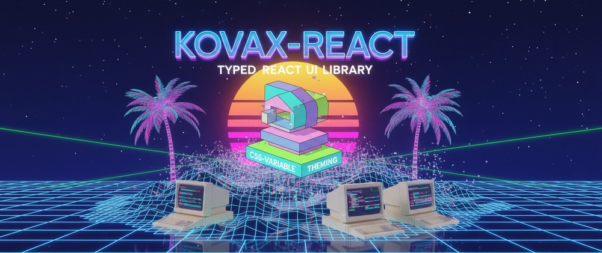

# Kovax UI — kovax-react **0.8.0**



React component library focused on layout primitives, typography, forms, data tables, and typed design tokens.


**Current release:** **`0.8.0`** · npm [`kovax-react`](https://www.npmjs.com/package/kovax-react) · [CHANGELOG](./CHANGELOG.md)

## Live documentation & demos

Browse **interactive examples** and the same **Markdown documentation** as in this repo (props tables, guides):

| Site | URL |
| ---- | --- |
| **Playground** (docs + live demos, EN/RU) | **[mrkamura.github.io/kovax](https://mrkamura.github.io/kovax/)** |
| **Storybook** (autoDocs, a11y, visual tests) | **[mrkamura.github.io/kovax/storybook](https://mrkamura.github.io/kovax/storybook/)** |

```bash
npm run dev:playground   # Vite playground
npm run dev:storybook    # Storybook on http://localhost:6006
```

The playground and Storybook load components from source via the `kovax-react` workspace alias; production builds are deployed by the CI workflow on push to `master` / `main`.

## Overview

| Area | Components / APIs |
| ---- | ----------------- |
| **Layout** | `Box`, `Flex`, `Grid`, `Stack` / `HStack` / `VStack`, `Center`, `Container`, `AspectRatio`, `Separator`, `Bleed`, `VisuallyHidden`, `Sticky` |
| **Typography** | `Text`, `Heading`, `Link`, `Code`, `Kbd`, `Blockquote`, `List`, `ListItem` |
| **Forms** | `FormControl`, `FormLabel`, `FormError`, `FormHelperText`, `FormGroup`, `FormControlContext`, `useFormControlContext`, `Input`, **`Textarea`**, `InputGroup`, `InputGroupContext`, `Checkbox`, `Radio`, `RadioGroup`, `Switch`, `Select`, `useCombobox`, `VirtualizedListbox`, **`DatePicker`**, **`DateRangePicker`** ( **`variant="date"`** · **`"datetime"`** ) |
| **Tables** | **`Table`** (`Table.Root`, caption, `Thead` / `Tbody` / `Tfoot`, `Tr`, `Th`, `Td`), **`DataTable`**, **`cycleSort`**, **`resolveDataCell`** |
| **Pagination** | **`Pagination`**, **`getPaginationItems`** (`kovax-react/pagination`) |
| **Overlays** | `Tooltip`, **`Popover`** / **`Dropdown`**, compound `Dialog`, structured `Modal`, `ToastProvider`, `useToast` |
| **Menu** | **`Menu`** / **`DropdownMenu`** — keyboard menu on **`Popover`** (`kovax-react/menu`) |
| **Navigation / disclosure** | **`Tabs`** (`Tabs.Root`, `Tabs.List`, `Tabs.Trigger`, `Tabs.Content`), **`Collapsible`** / **`Accordion`** (`Collapsible.Root` … `Accordion.Content`) |
| **Feedback / inline status** | **`Alert`** (`tone`, optional dismiss, live region), **`LinearProgress`** / **`CircularProgress`** (determinate & indeterminate) |
| **Actions** | `Button`, `IconButton`, `ButtonGroup` |
| **Theming & responsive** | **`ThemeProvider`**, **`useColorMode`**, **`useTheme`**, CSS variables (`--kx-*`), light/dark palettes, **`themeToken`**, **`colorToken`**, **`useMediaQuery`**, **`useBreakpointUp`**, breakpoint helpers — see [Design system](./docs/DESIGN_SYSTEM.md) · [Tokens](./docs/components/Tokens.md) |

Everything above is exported from the package root:

```ts
import {
  Box,
  Text,
  Button,
  IconButton,
  Input,
  Textarea,
  FormControl,
  ThemeProvider,
  themeToken,
} from "kovax-react";
```

### Optional entry points (deep imports)

Smaller bundles when you only need a slice of the library. **gzip ESM** sizes below (`dist/*.js`); peers **`react`**, **`react-dom`**, **`react/jsx-runtime`**, and optional **`react-day-picker`** are treated as externals. Limits are enforced by [`size-limit`](https://github.com/ai/size-limit) (`npm run size`); live npm analysis via [bundlejs.com](https://bundlejs.com).

<!-- bundlejs-config: %7B%22esbuild%22%3A%7B%22external%22%3A%5B%22react%22%2C%22react-dom%22%2C%22react%2Fjsx-runtime%22%2C%22react-day-picker%22%5D%7D%7D -->

| Import path | Contents | size-limit | bundlejs |
| ----------- | -------- | ---------- | -------- |
| `kovax-react` | Full public API | [](https://github.com/MrKamura/kovax/blob/master/.size-limit.json) | [](https://bundlejs.com/?q=kovax-react&config=%7B%22esbuild%22%3A%7B%22external%22%3A%5B%22react%22%2C%22react-dom%22%2C%22react%2Fjsx-runtime%22%2C%22react-day-picker%22%5D%7D%7D) |
| `kovax-react/server` | RSC-safe **`Box`**, **`Stack`**, **`Container`**, **`Text`**, **`Heading`** (no `"use client"`) | [](https://github.com/MrKamura/kovax/blob/master/.size-limit.json) | [](https://bundlejs.com/?q=kovax-react%2Fserver&config=%7B%22esbuild%22%3A%7B%22external%22%3A%5B%22react%22%2C%22react-dom%22%2C%22react%2Fjsx-runtime%22%2C%22react-day-picker%22%5D%7D%7D) |
| `kovax-react/layout` | Layout primitives | [](https://github.com/MrKamura/kovax/blob/master/.size-limit.json) | [](https://bundlejs.com/?q=kovax-react%2Flayout&config=%7B%22esbuild%22%3A%7B%22external%22%3A%5B%22react%22%2C%22react-dom%22%2C%22react%2Fjsx-runtime%22%2C%22react-day-picker%22%5D%7D%7D) |
| `kovax-react/typography` | Typography primitives | [](https://github.com/MrKamura/kovax/blob/master/.size-limit.json) | [](https://bundlejs.com/?q=kovax-react%2Ftypography&config=%7B%22esbuild%22%3A%7B%22external%22%3A%5B%22react%22%2C%22react-dom%22%2C%22react%2Fjsx-runtime%22%2C%22react-day-picker%22%5D%7D%7D) |
| `kovax-react/button` | `Button`, `IconButton`, `ButtonGroup` | [](https://github.com/MrKamura/kovax/blob/master/.size-limit.json) | [](https://bundlejs.com/?q=kovax-react%2Fbutton&config=%7B%22esbuild%22%3A%7B%22external%22%3A%5B%22react%22%2C%22react-dom%22%2C%22react%2Fjsx-runtime%22%2C%22react-day-picker%22%5D%7D%7D) |
| `kovax-react/input` | `Input`, `InputGroup`, **`Textarea`** | [](https://github.com/MrKamura/kovax/blob/master/.size-limit.json) | [](https://bundlejs.com/?q=kovax-react%2Finput&config=%7B%22esbuild%22%3A%7B%22external%22%3A%5B%22react%22%2C%22react-dom%22%2C%22react%2Fjsx-runtime%22%2C%22react-day-picker%22%5D%7D%7D) |
| `kovax-react/form` | Form primitives, `Checkbox` / `Radio` / `RadioGroup` / `Switch`, `Select`, `useCombobox`, `VirtualizedListbox`, + `FormControlContext` / `useFormControlContext` | [](https://github.com/MrKamura/kovax/blob/master/.size-limit.json) | [](https://bundlejs.com/?q=kovax-react%2Fform&config=%7B%22esbuild%22%3A%7B%22external%22%3A%5B%22react%22%2C%22react-dom%22%2C%22react%2Fjsx-runtime%22%2C%22react-day-picker%22%5D%7D%7D) |
| `kovax-react/overlays` | `Tooltip`, **`Popover`** / **`Dropdown`**, compound `Dialog`, structured `Modal`, `ToastProvider`, `useToast` | [](https://github.com/MrKamura/kovax/blob/master/.size-limit.json) | [](https://bundlejs.com/?q=kovax-react%2Foverlays&config=%7B%22esbuild%22%3A%7B%22external%22%3A%5B%22react%22%2C%22react-dom%22%2C%22react%2Fjsx-runtime%22%2C%22react-day-picker%22%5D%7D%7D) |
| `kovax-react/menu` | **`Menu`**, **`DropdownMenu`**, animation helpers (`ensureMenuKeyframes`, …) | [](https://github.com/MrKamura/kovax/blob/master/.size-limit.json) | [](https://bundlejs.com/?q=kovax-react%2Fmenu&config=%7B%22esbuild%22%3A%7B%22external%22%3A%5B%22react%22%2C%22react-dom%22%2C%22react%2Fjsx-runtime%22%2C%22react-day-picker%22%5D%7D%7D) |
| `kovax-react/tabs` | **`Tabs`** compound primitives (`Root`, `List`, `Trigger`, `Content`) | [](https://github.com/MrKamura/kovax/blob/master/.size-limit.json) | [](https://bundlejs.com/?q=kovax-react%2Ftabs&config=%7B%22esbuild%22%3A%7B%22external%22%3A%5B%22react%22%2C%22react-dom%22%2C%22react%2Fjsx-runtime%22%2C%22react-day-picker%22%5D%7D%7D) |
| `kovax-react/accordion` | **`Collapsible`** + **`Accordion`** compound primitives | [](https://github.com/MrKamura/kovax/blob/master/.size-limit.json) | [](https://bundlejs.com/?q=kovax-react%2Faccordion&config=%7B%22esbuild%22%3A%7B%22external%22%3A%5B%22react%22%2C%22react-dom%22%2C%22react%2Fjsx-runtime%22%2C%22react-day-picker%22%5D%7D%7D) |
| `kovax-react/alert` | **`Alert`** inline banner / live region | [](https://github.com/MrKamura/kovax/blob/master/.size-limit.json) | [](https://bundlejs.com/?q=kovax-react%2Falert&config=%7B%22esbuild%22%3A%7B%22external%22%3A%5B%22react%22%2C%22react-dom%22%2C%22react%2Fjsx-runtime%22%2C%22react-day-picker%22%5D%7D%7D) |
| `kovax-react/progress` | **`LinearProgress`**, **`CircularProgress`** | [](https://github.com/MrKamura/kovax/blob/master/.size-limit.json) | [](https://bundlejs.com/?q=kovax-react%2Fprogress&config=%7B%22esbuild%22%3A%7B%22external%22%3A%5B%22react%22%2C%22react-dom%22%2C%22react%2Fjsx-runtime%22%2C%22react-day-picker%22%5D%7D%7D) |
| `kovax-react/date-picker` | **`DatePicker`**, **`DateRangePicker`** (+ types); peer **`react-day-picker`** | [](https://github.com/MrKamura/kovax/blob/master/.size-limit.json) | [](https://bundlejs.com/?q=kovax-react%2Fdate-picker&config=%7B%22esbuild%22%3A%7B%22external%22%3A%5B%22react%22%2C%22react-dom%22%2C%22react%2Fjsx-runtime%22%2C%22react-day-picker%22%5D%7D%7D) |
| `kovax-react/table` | **`Table`** compound primitives, **`DataTable`**, helpers (**`cycleSort`**, **`resolveDataCell`**) | [](https://github.com/MrKamura/kovax/blob/master/.size-limit.json) | [](https://bundlejs.com/?q=kovax-react%2Ftable&config=%7B%22esbuild%22%3A%7B%22external%22%3A%5B%22react%22%2C%22react-dom%22%2C%22react%2Fjsx-runtime%22%2C%22react-day-picker%22%5D%7D%7D) |
| `kovax-react/pagination` | **`Pagination`**, **`getPaginationItems`** | [](https://github.com/MrKamura/kovax/blob/master/.size-limit.json) | [](https://bundlejs.com/?q=kovax-react%2Fpagination&config=%7B%22esbuild%22%3A%7B%22external%22%3A%5B%22react%22%2C%22react-dom%22%2C%22react%2Fjsx-runtime%22%2C%22react-day-picker%22%5D%7D%7D) |
| `kovax-react/tokens` | Tokens + **`themeToken`** / **`colorToken`**, **`ThemeProvider`**, **`useColorMode`**, **`useTheme`**, **`useMediaQuery`**, **`useBreakpointUp`**, breakpoint helpers, palettes | [](https://github.com/MrKamura/kovax/blob/master/.size-limit.json) | [](https://bundlejs.com/?q=kovax-react%2Ftokens&config=%7B%22esbuild%22%3A%7B%22external%22%3A%5B%22react%22%2C%22react-dom%22%2C%22react%2Fjsx-runtime%22%2C%22react-day-picker%22%5D%7D%7D) |
| `kovax-react/avatar` | **`Avatar`** — photo, initials, fallback | [](https://github.com/MrKamura/kovax/blob/master/.size-limit.json) | [](https://bundlejs.com/?q=kovax-react%2Favatar&config=%7B%22esbuild%22%3A%7B%22external%22%3A%5B%22react%22%2C%22react-dom%22%2C%22react%2Fjsx-runtime%22%2C%22react-day-picker%22%5D%7D%7D) |
| `kovax-react/badge` | **`Badge`** status / count pill | [](https://github.com/MrKamura/kovax/blob/master/.size-limit.json) | [](https://bundlejs.com/?q=kovax-react%2Fbadge&config=%7B%22esbuild%22%3A%7B%22external%22%3A%5B%22react%22%2C%22react-dom%22%2C%22react%2Fjsx-runtime%22%2C%22react-day-picker%22%5D%7D%7D) |
| `kovax-react/skeleton` | **`Skeleton`** loading placeholders | [](https://github.com/MrKamura/kovax/blob/master/.size-limit.json) | [](https://bundlejs.com/?q=kovax-react%2Fskeleton&config=%7B%22esbuild%22%3A%7B%22external%22%3A%5B%22react%22%2C%22react-dom%22%2C%22react%2Fjsx-runtime%22%2C%22react-day-picker%22%5D%7D%7D) |
| `kovax-react/tailwind` | **Tailwind CSS v4** `@theme inline` preset — `bg-kx-primary-500`, `p-kx-md`, … (CSS, not JS) | — | [docs/TAILWIND.md](./docs/TAILWIND.md) |
| `kovax-react/react-hook-form` | **`FormField`** adapter for **react-hook-form** (`FormControl` + ref/value injection) | [](https://github.com/MrKamura/kovax/blob/master/.size-limit.json) | [Form.md](./docs/components/Form.md#react-hook-form) |
| `kovax-react/tanstack-form` | **`FormField`** adapter for **@tanstack/react-form** | [](https://github.com/MrKamura/kovax/blob/master/.size-limit.json) | [Form.md](./docs/components/Form.md#tanstack-form) |

## What’s new (v0.8.0)

- **`ColorModeScript`** — FOUC guard for **`data-kovax-theme`** before first paint (`kovax-react/server`, Chakra-style).
- **`kovax-react/tailwind`** — Tailwind v4 preset maps all **`--kx-*`** tokens to utilities (`bg-kx-primary-500`, `rounded-kx-md`, …); **`@theme inline`** keeps **ThemeProvider** light/dark reactive — [Tailwind guide](./docs/TAILWIND.md).
- **`kovax-react/react-hook-form`** — **`FormField`** adapter: **`useController`** + **`FormControl`** context + ref/value injection — [Form docs](./docs/components/Form.md).
- **`kovax-react/tanstack-form`** — same **`FormField`** API for **TanStack Form**.

**Кратко по-русски:** пресет **Tailwind v4**; адаптеры **`FormField`** для **react-hook-form** и **TanStack Form**.

Full history: [CHANGELOG.md](./CHANGELOG.md).

### Highlights from v0.7

- **`kovax-react/server`** — RSC-safe **`Box`**, **`Stack`**, **`Container`**, **`Text`**, **`Heading`** — [Next.js App Router](./docs/NEXTJS_APP_ROUTER.md).
- **`"use client"`** in client bundles; **jest-axe** in tests; **size-limit** / **bundlejs** badges.

### Highlights from v0.6

- **`Pagination`** — accessible pager and **`kovax-react/pagination`** entry — [Pagination](./docs/components/Pagination.md).
- **Responsive hooks** — **`useMediaQuery`**, **`useBreakpointUp`**, **`breakpointMinMediaQuery`** — [Tokens](./docs/components/Tokens.md).
- **`Avatar`**, **`Badge`**, **`Menu`**, **`Skeleton`** — new components with dedicated **`kovax-react/*`** entries.

### Highlights from v0.5

- **ThemeProvider & dark mode** — mount **`ThemeProvider`** once (or scope with **`target`**); light/dark **`colorMode`**, optional **`palettes`** overrides, **`localStorage`** persistence (**`storageKey`**), CSP **`nonce`** on injected styles. **`themeToken`** / **`colorToken`** resolve to **`var(--kx-…, hex-fallback)`** so components follow CSS variables when the provider is active; without it, fallbacks keep previous hex appearance.
- **Hooks** — **`useColorMode()`** (`setColorMode`, `toggleColorMode`, resolved vs stored mode) and **`useTheme()`** (active palette + scope selector).
- **Playground** — static **prerender** for better SEO (**`sitemap.xml`**, **`robots.txt`**, per-route meta); **Components → ThemeProvider** live docs with examples.

### Highlights from v0.4

- **Playground** — responsive layout, sticky header with backdrop blur, redesigned **Home** (hero + CTAs + quick cards), documentation topics as a **responsive grid** (no cramped horizontal tab strip), wider column for Markdown docs; **EN/RU** language switcher available on every section; live sections for **Accordion**, **Alert**, **Controls**, **Date picker**, **Overlays**, **Progress**, **Select**, **Tabs**, **Table**, and more. **`react-hook-form`** is still **only** a playground dependency (e.g. **Input** / **Date picker** demos).
- **Table & DataTable** — token-backed **`Table.*`** primitives (`variant`, `size`, striped rows, sticky header) plus **`DataTable`** with columns, **`rowHeader`**, and optional controlled sort — see [Table](./docs/components/Table.md); **`kovax-react/table`**.
- **Textarea** — same chrome as **`Input`** (variants, **`FormControl`** context, **`floatingLabel`**, character counter, **`resize`**) — see [Textarea](./docs/components/Textarea.md); **`kovax-react/input`**.
- **Date picker** — **`variant="datetime"`** (time inputs + **Apply**) for **`DatePicker`** and **`DateRangePicker`**; playground + docs examples — see [DatePicker](./docs/components/DatePicker.md); **`kovax-react/date-picker`**.

### Highlights from v0.3

- **Accordion & Collapsible**, **Alert**, **Progress**, **Tabs**, overlays (**Popover**, **Dialog**, **Modal**, **Toast**, …), **Input** (floating label, clear, masks), **Select** & **useCombobox**, **Form** context wiring — see [docs/README.md](./docs/README.md).

### Foundations

- **Typography** — token-backed `sizes.text` and spacing props where applicable.
- **`ThemeProvider`**, **`useColorMode`**, **`useTheme`** — CSS variables and dark mode ([Design system](./docs/DESIGN_SYSTEM.md)); **`themeToken`** / **`colorToken`** — `var(--kx-…)` with hex fallbacks ([Tokens](./docs/components/Tokens.md)).
- **Live site** — [mrkamura.github.io/kovax](https://mrkamura.github.io/kovax/) (EN/RU UI chrome).

## Requirements

- `react` and `react-dom` **^18 || ^19** (peer dependencies)
- **`react-day-picker` ^9** (peer dependency) when using **`DatePicker`** / **`DateRangePicker`** — install alongside `kovax-react` and import **`react-day-picker/style.css`** once in your app (see [DatePicker](./docs/components/DatePicker.md)).

## Installation

```bash
npm install kovax-react react-day-picker
```

If you do not use the date pickers, you may omit **`react-day-picker`** (it remains an optional peer).

```bash
npm install kovax-react
```

```bash
yarn add kovax-react
```

## Usage

Wrap your app (or a subtree) with **`ThemeProvider`** so **`themeToken`** / **`colorToken`** values resolve through CSS variables and respond to light/dark mode:

```tsx
import { ThemeProvider } from "kovax-react";

export function App({ children }: { children: React.ReactNode }) {
  return (
    <ThemeProvider defaultColorMode="system">
      {children}
    </ThemeProvider>
  );
}
```

```tsx
import {
  Box,
  VStack,
  HStack,
  Button,
  Input,
  FormControl,
  FormLabel,
  Text,
  themeToken,
} from "kovax-react";

export function SignInExample() {
  return (
    <Box
      p={32}
      backgroundColor={themeToken("secondary.50")}
      borderRadius={themeToken("borderRadius.md")}
      maxW={480}
      m="40px auto"
      boxShadow={themeToken("shadow.md")}
    >
      <VStack gap={24} align="stretch">
        <Text size="lg" fontWeight={600}>
          Sign in
        </Text>

        <FormControl isRequired>
          <FormLabel htmlFor="email">Email</FormLabel>
          <Input id="email" type="email" placeholder="you@example.com" />
        </FormControl>

        <FormControl>
          <FormLabel htmlFor="password">Password</FormLabel>
          <Input
            id="password"
            type="password"
            floatingLabel
            placeholder="Password"
          />
        </FormControl>

        <HStack justify="flex-end" gap={12}>
          <Button variant="outline">Cancel</Button>
          <Button variant="solid" color="primary">
            Log in
          </Button>
        </HStack>
      </VStack>
    </Box>
  );
}
```

`Box` supports `forwardRef` and forwards native attributes while spacing props are turned into CSS. `Button`, `Input`, `Select`, `Checkbox`, `Radio`, `Switch`, `IconButton`, and `Text` forward refs to their underlying DOM nodes where applicable.

## Features

- TypeScript-first props, including polymorphic `Box` with the `as` prop
- Spacing scale via `SpacingProps` (`m`, `p`, `w`, flex, grid, and more) on layout and several other primitives
- Accessible patterns where components expose roles, labels, and focus-visible styling (e.g. `Button`, `Input`, `Textarea`, `Select`, `Checkbox`, `Switch`, `FormError`, `useCombobox`, `Tabs`, `Alert`, `DataTable` sort controls)
- Jest tests under `src/components/**/__tests__`

## Tech stack

- React 18 in development; peers declare **React ^18 || ^19**
- TypeScript 5, **tsup** for library builds
- **Vite** + **react-markdown** for the optional playground app (`apps/playground`); production builds run a **prerender** step for static HTML per route; **react-hook-form** is used only in playground demos, not shipped with the library.

## Documentation

| Topic | Link |
| ----- | ---- |
| **Live docs & demos** | **[https://mrkamura.github.io/kovax/](https://mrkamura.github.io/kovax/)** (includes **Components → ThemeProvider**) |
| Component index | [docs/README.md](./docs/README.md) |
| Getting started | [docs/GETTING_STARTED.md](./docs/GETTING_STARTED.md) |
| Next.js App Router | [docs/NEXTJS_APP_ROUTER.md](./docs/NEXTJS_APP_ROUTER.md) |
| Design system / tokens | [docs/DESIGN_SYSTEM.md](./docs/DESIGN_SYSTEM.md) |
| Tokens reference | [docs/components/Tokens.md](./docs/components/Tokens.md) |
| Button | [docs/components/Button.md](./docs/components/Button.md) |
| Input | [docs/components/Input.md](./docs/components/Input.md) |
| Textarea | [docs/components/Textarea.md](./docs/components/Textarea.md) |
| Controls (Checkbox / Radio / Switch) | [docs/components/Controls.md](./docs/components/Controls.md) |
| Select & Combobox | [docs/components/Select.md](./docs/components/Select.md) |
| Tabs | [docs/components/Tabs.md](./docs/components/Tabs.md) |
| Accordion & Collapsible | [docs/components/Accordion.md](./docs/components/Accordion.md) |
| Alert | [docs/components/Alert.md](./docs/components/Alert.md) |
| Progress | [docs/components/Progress.md](./docs/components/Progress.md) |
| Date picker | [docs/components/DatePicker.md](./docs/components/DatePicker.md) |
| Table & DataTable | [docs/components/Table.md](./docs/components/Table.md) |
| Pagination | [docs/components/Pagination.md](./docs/components/Pagination.md) |
| Overlays (Tooltip, Popover, Dialog, …) | [docs/components/Overlays.md](./docs/components/Overlays.md) |
| Form | [docs/components/Form.md](./docs/components/Form.md) |

On **npm**, relative links in this readme resolve against the package page on [npmjs.com](https://www.npmjs.com/package/kovax-react).

## Sponsored by

Corporate sponsorship helps fund ongoing work on **kovax-react**. Logo placement by tier (USD per month):

| Tier | Monthly | Placement |
| ---- | ------- | --------- |
| **Bronze** | **$50** | Logo in this README |
| **Silver** | **$200** | Logo in README + on the [live documentation site](https://mrkamura.github.io/kovax/) |
| **Gold** | **$500** | README + live site + thank-you in release notes |

### Logo wall

Logos are listed below as sponsors join.

| Bronze ($50) | Silver ($200) | Gold ($500) |
| ------------ | ------------- | ----------- |
| *Your logo — slot available* | *Your logo — slot available* | *Your logo — slot available* |

To discuss a tier, use the **Support** section on the [playground](https://mrkamura.github.io/kovax/) or reach out via [Boosty](https://boosty.to/mrkamura).

## Hire the maintainer

Paid engagements around **kovax-react** and related React / UI work:

- **Integration** — adopting the library in your app, theming, aligning tokens with your stack  
- **Custom components** — extending kovax primitives or building new ones to spec  
- **Design systems** — component sets and documentation tailored to your product  

**Rates:** from **$20 USD/hour**; **fixed-price** projects by agreement.

**Contact:** [@mr_kamura](https://t.me/mr_kamura) on Telegram.

## Scripts (contributors)

```bash
npm install
npm run build              # library bundle → dist/
npm run size               # gzip size limits (size-limit)
npm test                   # Jest
npm run type-check         # tsc --noEmit
npm run dev:playground     # Vite dev server for apps/playground
npm run build:playground   # production build of the playground
```

Automation (maintainers): pushing a version tag `v*` publishes to npm if `NPM_TOKEN` is configured; pushes to `master`/`main` can deploy the playground via the workflow under `.github/workflows/`.

## Contributing

Fork the repository, create a branch, open a pull request. Changes are expected to pass `npm test` and `npm run type-check`.

## License

[MIT](./LICENSE)
